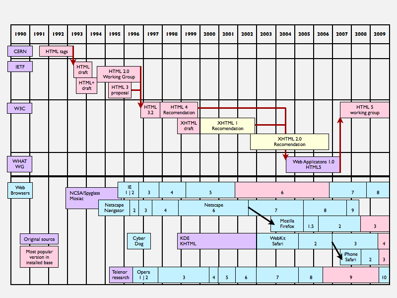

圖片來自 [http://topshelfcopy.com/wp-content/uploads/2012/12/html-timeline.png](http://topshelfcopy.com/wp-content/uploads/2012/12/html-timeline.png)

資料來源：
- http://www.w3.org/People/Berners-Lee/9602affi.html
- http://www.w3.org/People/Berners-Lee/
- http://www.w3.org/History/1989/proposal.html
- http://topshelfcopy.com/evolution-of-html5-as-doorway-to-open-web/
- http://lazarus.elte.hu/hun/dolgozo/zentail/ica/internet/html1.htm
- http://www.atendesigngroup.com/blog/brief-history-of-html
- http://www.w3.org/html/wg/wiki/History
- http://hixie.ch/commentary/web/history
- http://www.htmlgoodies.com/tutorials/html_401/html4-ref/article.php/3460261/A-Brief-History-of-HTML.htm
- http://diveintohtml5.info/past.html
- Introducting html5(book)